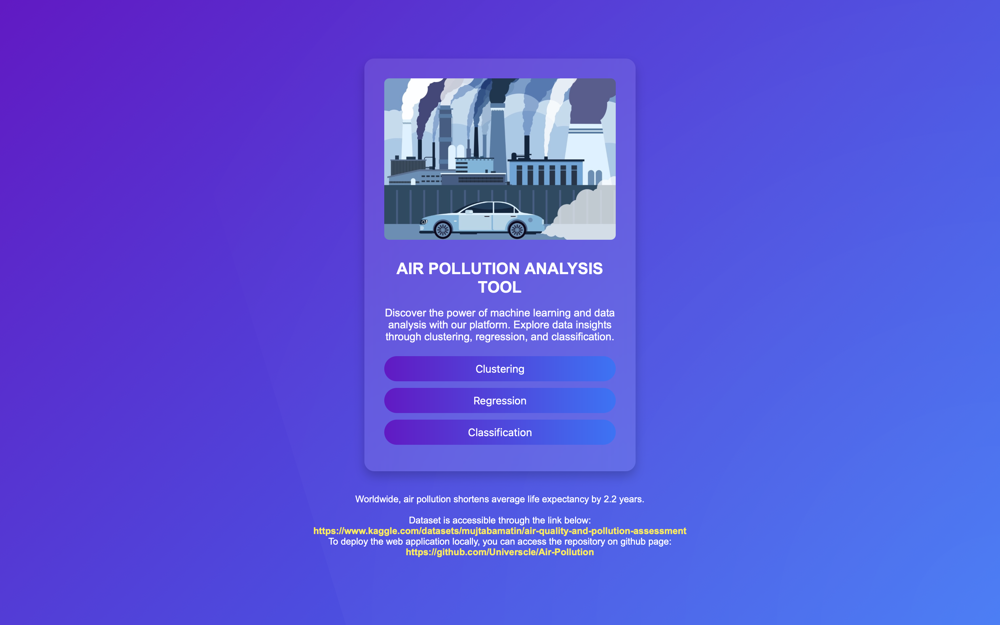
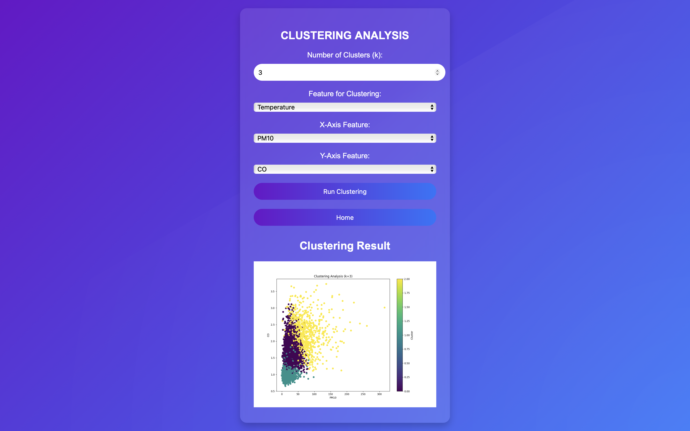
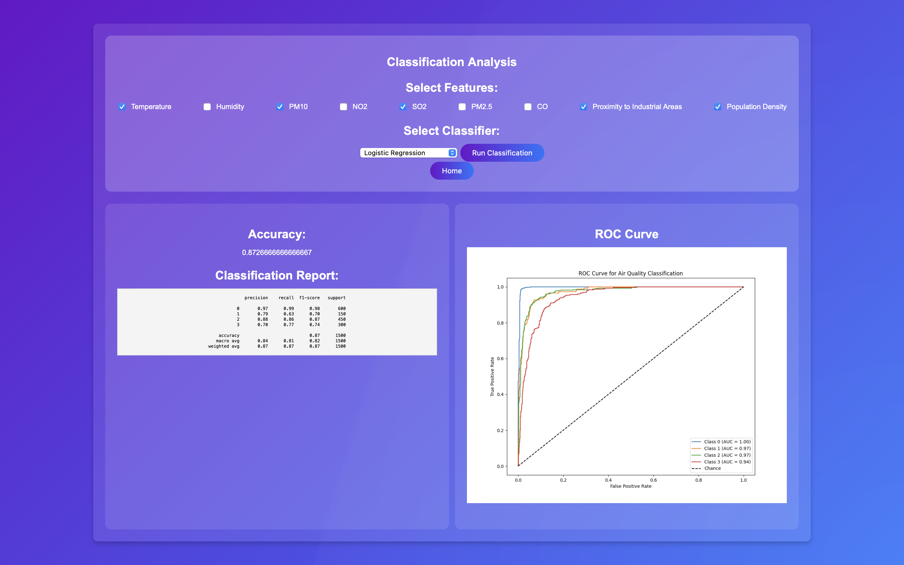
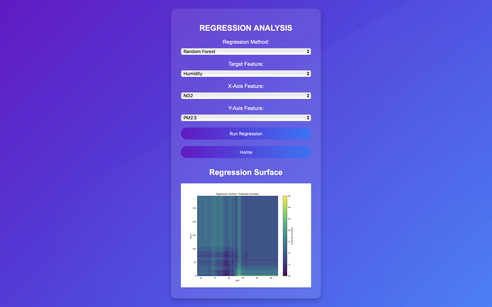

# Air Quality Analysis Web App

This project is a Flask-based web application for analyzing air quality data through classification, regression, and clustering techniques. The app allows users to interactively select features, classifiers, or regression methods to generate predictions and visualize results.

## Features

- **Classification**:
  - Perform air quality classification using various algorithms like Logistic Regression, SVM, Random Forest, and Naive Bayes.
  - Generate classification reports, accuracy metrics, and real-time ROC curves.

- **Regression**:
  - Analyze and visualize regression surfaces using Linear Regression, Ridge, Lasso, Decision Trees, and Random Forest.
  - Predict air quality metrics interactively.

- **Clustering**:
  - Conduct K-means clustering to uncover patterns in air quality data.
  - Visualize clusters with interactive scatter plots.

- **Interactive Visualizations**:
  - Real-time visualizations for regression surfaces, clustering, and classification metrics.

---

## Dataset

This project uses the **[Air Quality and Pollution Assessment](https://www.kaggle.com/datasets/mujtabamatin/air-quality-and-pollution-assessment)** dataset, which is made available under the **Apache 2.0 License**.

### License Summary

The Apache 2.0 License allows you to:

- Freely use, modify, and distribute the dataset for personal, educational, or commercial purposes.
- Include the license and copyright notice in any distributed copies or derivative works.

For full details, refer to the **[Apache 2.0 License](https://www.apache.org/licenses/LICENSE-2.0)**.

### Dataset Features & Target Variable

The dataset contains the following attributes:
- **Temperature (°C)**: Average temperature of the region.
- **Humidity (%)**: Relative humidity recorded in the region.
- **PM2.5 Concentration (µg/m³)**: Fine particulate matter levels.
- **PM10 Concentration (µg/m³)**: Coarse particulate matter levels.
- **NO2 Concentration (ppb)**: Nitrogen dioxide levels.
- **SO2 Concentration (ppb)**: Sulfur dioxide levels.
- **Population Density**: Population per square kilometer.
- **CO Concentration (ppm)**: Carbon monoxide levels.
- **Proximity to Industrial Areas (km)**: Distance to the nearest industrial zone.
- **Population Density (people/km²)**: Number of people per square kilometer in the region.
  
The target variable is **Air Quality** which has four levels:
- **Good**: Clean air with low pollution levels.
- **Moderate**: Acceptable air quality but with some pollutants present.
- **Poor**: Noticeable pollution that may cause health issues for sensitive groups.
- **Hazardous**: Highly polluted air posing serious health risks to the population.
  
---

## Screenshots

<p float="left">
  
  
</p>

<p float="left">
  
  
</p>

---

## Getting Started

### Prerequisites

- Python 3.7 or higher
- Virtual environment (recommended)

### Installation

1. **Clone the repository**:

   ```bash
   git clone https://github.com/Universcle/Air-Pollution.git
   cd Air-Pollution
   ```

2. **Set up the virtual environment**:
   ```bash
   python -m venv venv
   source venv/bin/activate  # macOS/Linux
   venv\Scripts\activate     # Windows
   ```

3. **Install dependencies**:
   ```bash
   pip install -r requirements.txt
   ```

4. **Prepare the dataset**:
   - Place the `updated_pollution_dataset.csv` in the project directory.

5. **Run the application**:
   ```bash
   python app.py
   ```

6. Open your browser and go to [http://127.0.0.1:5000](http://127.0.0.1:5000).

---

## File Structure

- **`app.py`**: Backend Flask application managing routes, machine learning models, and data processing.
- **`templates/`**: HTML templates for the web interface.
- **`static/`**: CSS, JavaScript, and images for the frontend.
- **`updated_pollution_dataset.csv`**: Dataset for air quality analysis.

---

## License

This project is licensed under the **MIT License**. See the `LICENSE` file for details.

---

This version is more detailed and user-friendly, providing clear instructions and highlighting features effectively. Let me know if you'd like any additional changes!
